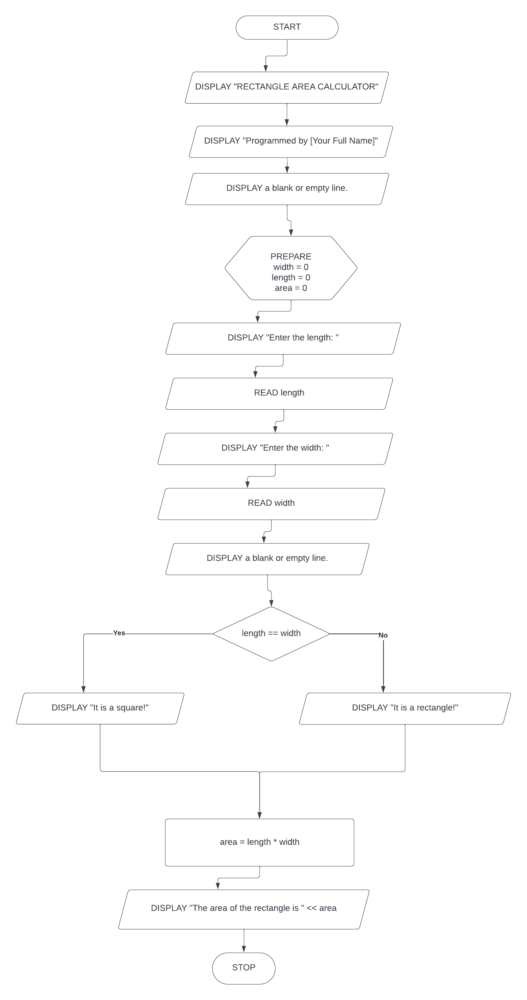
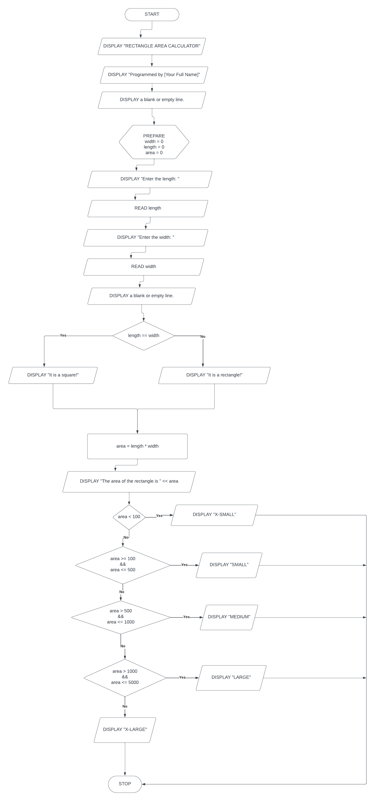

## CP1 | 2023-11-12
Conditional or Branching Control Flow

### Square or Rectangle
#### Flowchart

#### C++ Source Code
```cpp
#include <iostream>
#include <cstdlib>

using namespace std;

int main()
{
    // display header
    cout << "RECTANGLE AREA CALCULATOR" << endl;
    cout << "Programmed by YourFullName" << endl;
    cout << endl;
    
    // declare and initialize variables
    double length = 0;
    double width  = 0;
    double area   = 0;
    
    // get input
    cout << "Enter the length: ";
    cin  >> length;
    cout << "Enter the width : ";
    cin  >> width;
    
    cout << endl;
    
    // decision: square or rectangle
    if( length == width )
    {
        // true
        cout << "It's a square!" << endl;
    }
    else
    {
        // false
        cout << "It's a rectangle!" << endl;
    }
    
    // compute for area
    area = length * width;
    
    // display the area
    cout << "The area is " << area << "." << endl;
    
    
    cout << endl << endl;
    system("PAUSE");
    return 0;
}
```

---

### Rectangle Size
#### Flowchart


#### C++ Source Code
```cpp
#include <iostream>
#include <cstdlib>

using namespace std;

int main()
{
    // display header
    cout << "RECTANGLE AREA CALCULATOR" << endl;
    cout << "Programmed by YourFullName" << endl;
    cout << endl;
    
    // declare and initialize variables
    double length = 0;
    double width  = 0;
    double area   = 0;
    
    // get input
    cout << "Enter the length: ";
    cin  >> length;
    cout << "Enter the width : ";
    cin  >> width;
    
    cout << endl;
    
    // decision: square or rectangle
    if( length == width )
    {
        // true
        cout << "It's a square!" << endl;
    }
    else
    {
        // false
        cout << "It's a rectangle!" << endl;
    }
    
    // compute for area
    area = length * width;
    
    
    // display the area
    cout << "The area is " << area << "." << endl;
    
    
    // decision: determine size
    if(area < 100)
    {
        cout << "X-SMALL";
    }
    else if(area >= 100 && area <= 500)    // left condition can be omited
    {
        cout << "SMALL";
    }
    else if(area > 500 && area <= 1000)
    {
        cout << "MEDIUM";
    }
    else if(area > 1000 && area <= 5000)
    {
        cout << "LARGE";
    }
    else
    {
        cout << "X-LARGE"
    }
    
   
    cout << endl << endl;
    system("PAUSE");
    return 0;
}
```
